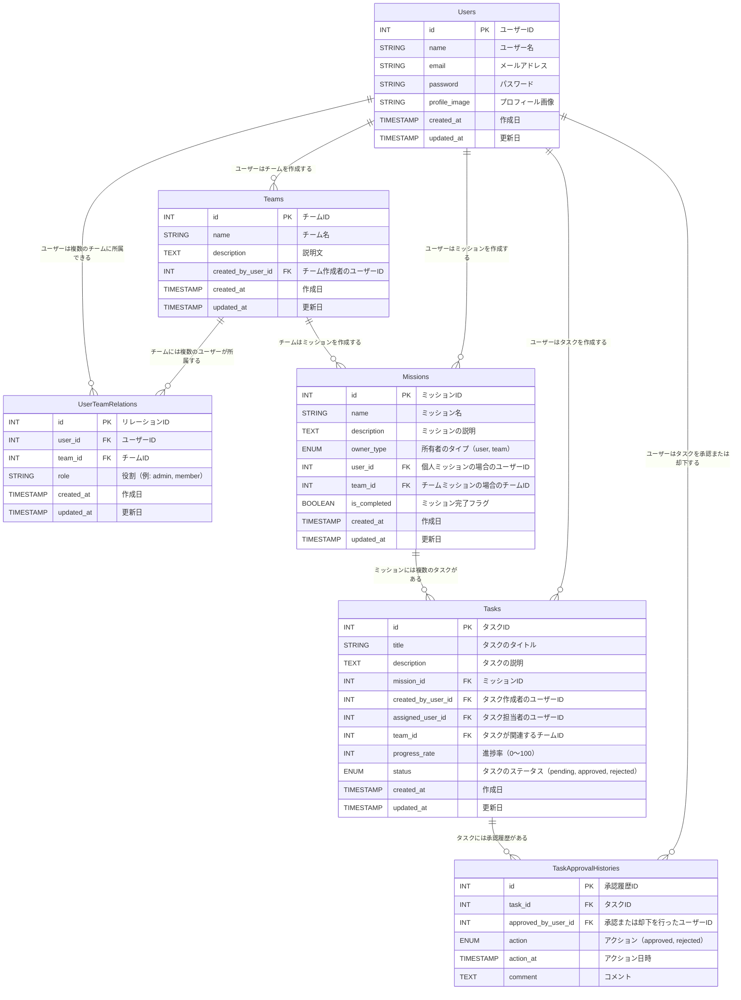

# DMission-README
## サービス概要

「DMission」は1つの目的(mission)を果たすためにチーム員でタスクを作成し、
誰がそのタスクをいつまでにやらなければいけないかを明確にできるTODOアプリケーションです。
本サービスはビジネスや友達、家族間の日々のやり取りの中で誰がボールを持っているのかを明確にすることで、
コミュニケーションコスト削減を目的としています。
このアプリを通じて、ユーザーに対してシンプルかつ効果的なタスク管理を提供し、
円滑なチームワークや迅速なタスク完了をサポートします。

## このサービスへの思い・作りたい理由
仕事をしている中で今、タスク誰に与えられているかどうか不明な時がある。
それはコミュニケーション不足であったり、曖昧な表現で打合せ等が終わることが少なからずあるからだと思います。
それにより、余分にコミニケーションを取る時間などを短縮したいと思ったからです。

## ユーザー層について
・コミュニケーションが苦手な人に向けて
　理由（電話などせずに本アプリを通じて必要最低限のやりとりで業務を遂行できるため)
・日々無駄な打ち合わせを無くしたい方に向けて
　理由（本アプリを通じて事前に目的を遂行するために最短で進めることができるため）

## サービスの利用イメージ
・スマートフォンでタスク追加：いつでもどこでもタスクの予実管理ができる
・このサービスを利用することで、ユーザーは無駄なやり取りや混乱を防ぎ、シンプルで効率的なタスク管理を行えるようになる
・各メンバーはアプリ内で自分のタスクを確認でき、進行状況を更新することが可能です。

## ユーザーの獲得について
SNSで拡散するだけでなく、所属会社、コミュニティなどを通じてユーザー獲得をしていく予定です。

## サービスの差別化ポイント・推しポイント
類似サービスとしては「Slack」,「monday.com」,「notion」があります。
カスタマイズ可能なため、多機能である一方、設定が複雑になりがちなのに対して、
本アプリは以下に特化したアプリとなります。
・タスクの担当者と期限の明確化（期限前通知機能）
  シンプルさに重点を置き、誰でも直感的に使えるタスク管理ツールで学習コストを最小限としています。
  -タスクの作成や編集はワンクリックでアクセス可能なボタンに集約。
  -タスクの進捗状況を確認したい場合は、タスクカードの進捗率がバーで確認できる。
  -個人ページ画面の左側には「タスク一覧」画面が右側には全体の進捗画面がグラフで確認できる。
・タスク完了の承認機能
　管理者が担当者のタスクを確認・承認する機能です。
・個別タスクの進捗トラッキング
　各タスクに対して進捗率を設定できるようにし、タスクの完了度合いを視覚化します。
　
## 機能候補
【MVPリリース時】
・ユーザー登録機能
・ユーザー情報編集機能
・通常ログイン機能
・ログアウト機能
・チーム登録機能
・タスク追加機能
・ミッション追加機能

【本リリース】
ログイン機能（Google認証）
パスワードリセット機能
アカウント削除機能
ミッション検索機能
タスク承認機能
ミッション一覧表示機能
個人ダッシュボード表示機能
チームダッシュボード表示機能
お問い合わせ、利用規約、プライバシーポリシー

## 機能の実装方針予定
・Gmail通知機能
・Googleカレンダ機能
・GoogleMap機能

## 技術スタック
| カテゴリー  | 使用技術 |
| ------------- | ------------- |
| バックエンド  | Ruby /Ruby on Rails |
| フロンドエンド  | Nextjs　/ TypeScript / React / JavaScript |
| CSSフレームワーク  | Tailwind CSS　/ Framer Motion / Shadcn/ui / Magic Ui |
| データベース | PostgreSQL |
| 認証機能 | device / omniauth-google-oauth2 |
| 開発環境 | Docker |
| デプロイ | Vercel / Heroku |
| API | Google Calendar API / Gmail API / Google Maps API|

## 画面遷移図
Figma：https://www.figma.com/design/BWtX381uP7DbSyZO9cGE1n/Dmission?m=auto&t=Lrbz9hHPXVx0q8Lk-6

## ER図

